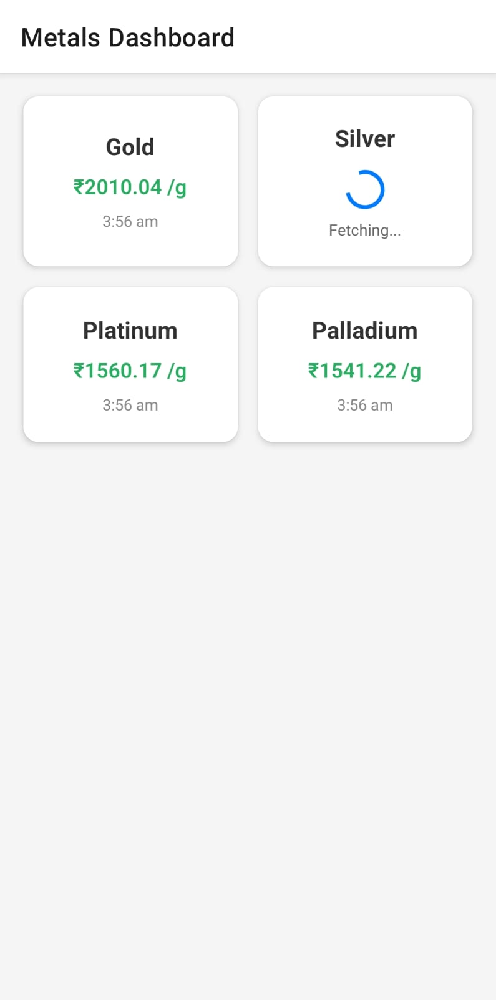
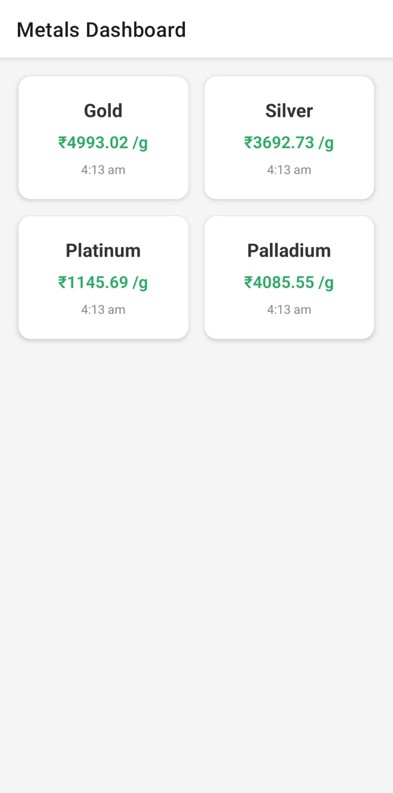
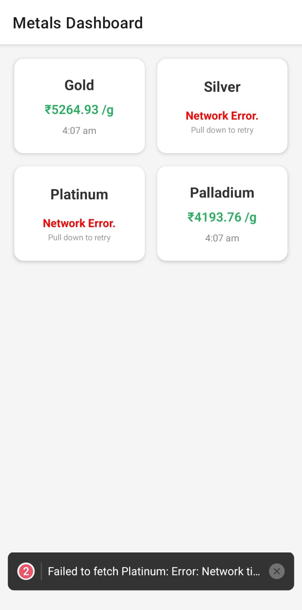
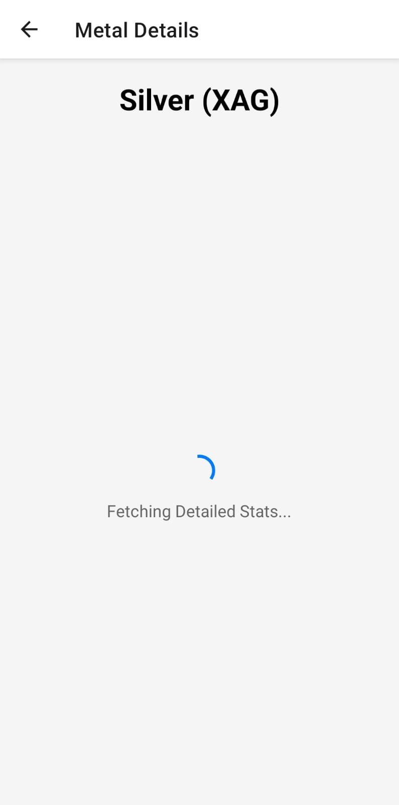
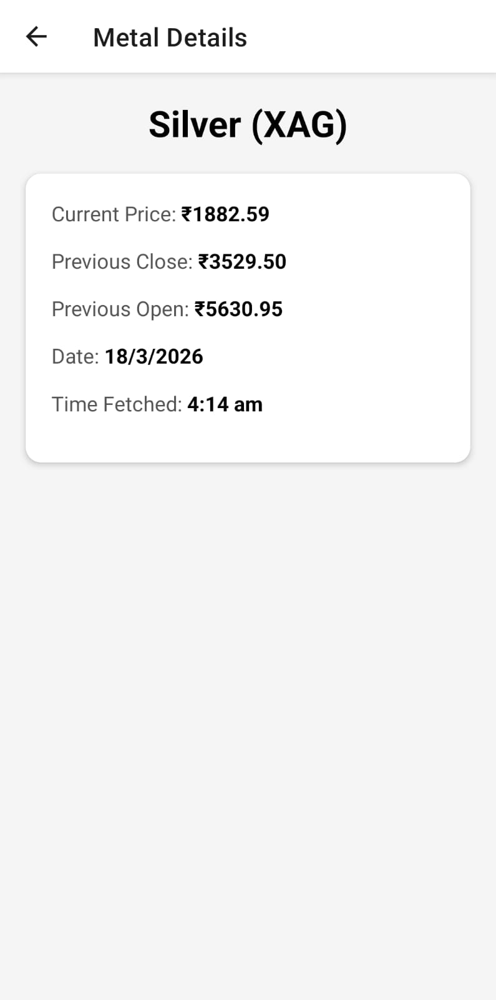

# Precious Metals Tracker - Simplify Money Assignment

A React Native mobile application that emulates the live metal price fetching flow, featuring independent loading states, error handling, and dynamic navigation.

## 📸 App Screenshots

  
  
  

  
  

## 🚀 How to Execute & Deployment Notes

1. **Prerequisites:** Ensure you have Node.js installed.
2. **Clone the repo:** `git clone <YOUR_REPO_URL>`
3. **Install Dependencies:** Navigate to the folder and run `npm install`.
4. **Start the App:** Run `npx expo start`.
5. **View the App:** Download the **Expo Go** app on an iOS or Android device and scan the QR code generated in the terminal.

## 🛠️ Approach & Architecture

- **Framework Choice:** Built using **Expo** and **React Native**. I utilized `expo-router` for file-based routing which implements React Navigation seamlessly under the hood.
- **Component-Level State:** To fulfill the requirement of "different loaders" for each metal, I abstracted the tile UI into a separate `<MetalTile />` component. This allows each tile to manage its own `isLoading` and `error` states independently, preventing a single slow network request from bottlenecking the entire UI.
- **Mock API Simulation:** Instead of hitting a free API (which often has strict rate limits that can break during testing), I built an asynchronous mock API using `Promises` and `setTimeout`.
- **Pull-to-Refresh:** Implemented `RefreshControl` on the main `FlatList`. Pulling down updates a trigger state, causing all child components to re-run their fetch sequences independently.

## ⚠️ Challenges & Error Handling

- **Simulated Network Failures:** To properly demonstrate error handling, the mock API has a built-in 10% failure rate. If a fetch fails, the `catch` block triggers a dedicated Error UI on the specific tile without crashing the app.
- **Handling Independent Retries:** By tying the tile's `useEffect` to a `refreshTrigger` prop passed down from the parent dashboard, users can easily pull-to-refresh to retry any failed independent API calls.
